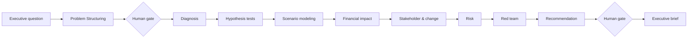

# DecisionForge AI

### Agentic Strategy & Transformation Workbench

**DecisionForge AI** is an evidence-driven decision-support workspace that turns an ambiguous management problem into a structured, inspectable decision chain: **problem framing → hypotheses → diagnostics → strategic alternatives → financial impact → risk → red-team challenge → recommendation → implementation**.

The demo uses a fictional European B2B services company, **Northstar Services Group**, and entirely synthetic data. It is intentionally built to demonstrate structured business problem solving rather than company-specific knowledge.

## Executive case

Revenue has grown **11.0%**, yet EBIT margin has fallen from **14.0% to 8.0%**. Customer satisfaction is down, cycle time is up and performance varies materially across 12 regional business units.

> **Management question:** How should the company restore margin while protecting growth and customer experience?

## What makes this different from a chatbot

DecisionForge separates specialist responsibilities and keeps assumptions visible:

1. **Problem Structuring Agent** — SCQ, MECE-style issue tree and hypotheses.
2. **Diagnostic Analyst Agent** — KPI, regional and driver analysis.
3. **Hypothesis Agent** — tests competing explanations.
4. **Scenario Agent** — models four strategic alternatives.
5. **Financial Impact Engine** — value, investment, margin and payback.
6. **Stakeholder & Change Agent** — adoption dependencies and stakeholder needs.
7. **Risk Agent** — execution and value-realization risk register.
8. **Red-Team Agent** — challenges double-counting, causal overreach and downside sensitivity.
9. **Recommendation Agent** — synthesizes trade-offs into a decision.
10. **Executive Communication Agent** — produces an exportable management brief.

Two **human approval gates** keep accountability explicit. Evidence IDs are carried through the analysis so the recommendation has a traceable audit trail.

## Live product behavior

The app works with **no API key and no paid service**. Its deterministic decision engine is fully inspectable in `src/engine.mjs`. A provider-agnostic optional synthesis endpoint exists in `api/synthesize.js`; if no provider variables are configured it safely returns an evidence-based deterministic fallback.

### Sensitivity controls

The live case lets users adjust:

- savings realization;
- implementation cost;
- disruption;
- adoption.

Scenario economics and the recommendation are recalculated immediately.

## Architecture



Detailed workflow: [`architecture/agent-workflow.md`](architecture/agent-workflow.md)

## Run locally

No dependencies are required.

```bash
python3 -m http.server 4173
```

Then open `http://localhost:4173`.

## Test

```bash
npm test
npm run validate
# or
npm run check
```

The repository uses only Node's built-in test runner, so CI does not require dependency installation.

## Deploy

The project is deployment-ready for Vercel as a static frontend with an optional serverless `/api/synthesize` endpoint. `vercel.json` includes basic security headers.

## Repository map

```text
.
├── index.html                    # Executive decision room
├── styles.css                   # Responsive consulting-style UI
├── src/
│   ├── app.mjs                  # UI state, gates, sensitivity controls, export
│   ├── case-data.mjs            # Synthetic company + regional case data
│   └── engine.mjs               # Agentic decision engine
├── api/synthesize.js            # Optional provider-backed synthesis + fallback
├── data/                         # Synthetic CSV evidence
├── scenarios/                    # Scenario reference files
├── architecture/agent-workflow.md
├── tests/engine.test.mjs
├── scripts/validate-static.mjs
├── CASE_STUDY.md
├── METHODOLOGY.md
├── EVALUATION.md
└── EXECUTIVE_BRIEF.md
```

## Responsible use

DecisionForge is a portfolio demonstration of decision-support architecture. It does **not** represent a real company, client engagement or proprietary dataset, and it should not be used for real financial decisions without verified source data and human review.

## License

MIT
