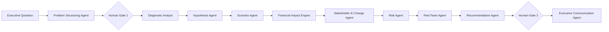

# Agent workflow

The deterministic engine is intentionally inspectable: calculations, thresholds and evidence IDs live in source control. An optional provider-backed synthesis endpoint can be enabled at deployment time, but the portfolio demo never depends on it.
